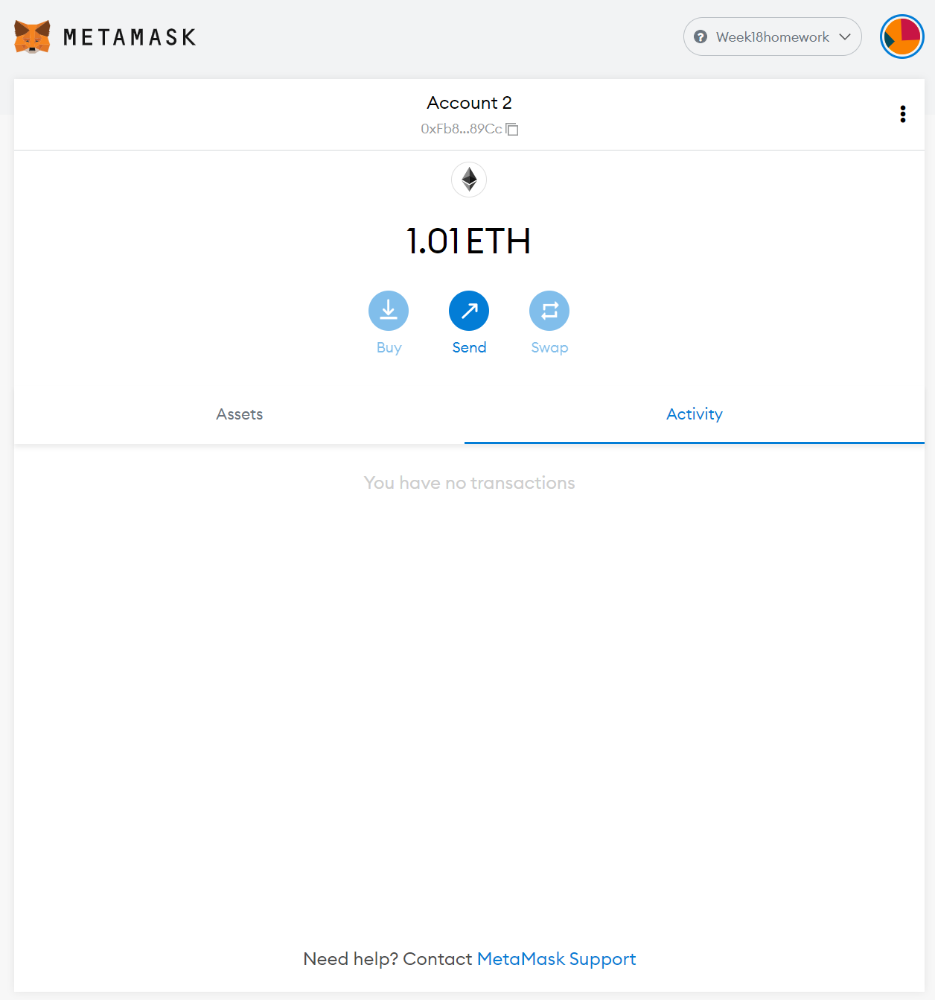
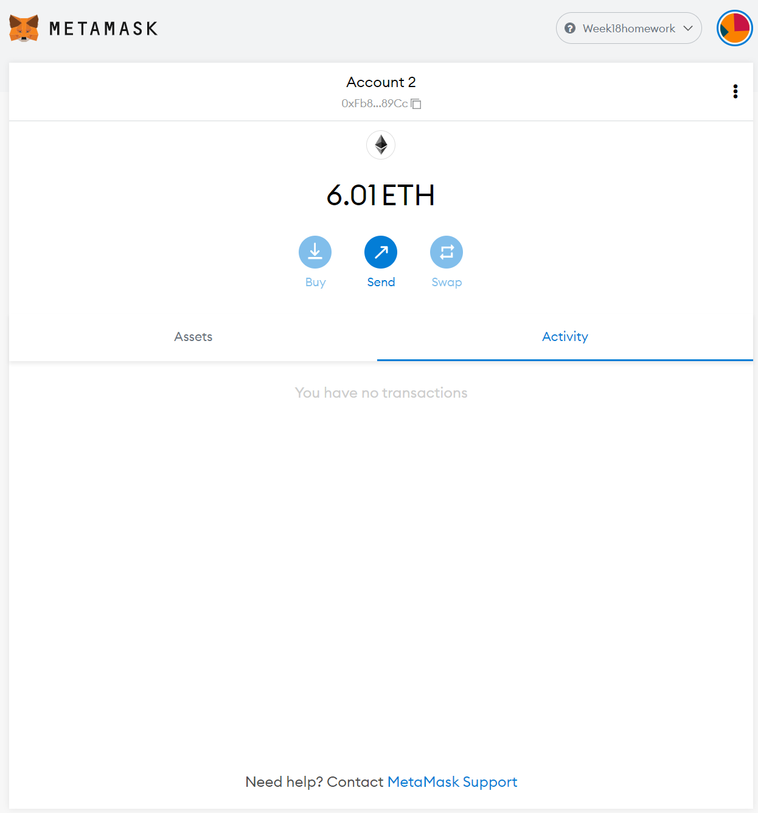

# Weeek19 homework

I created a wallet which allows you to manage your crypto assets. With this wallet you can mange addresses not only for one crypto currency but for over 300 currencies. HD Wallet Derive is a command line tool that supports BIP32, BIP39 and BIP44, which means you can derive addresses across various crypto currencies. But for this task I only include Bitcoin and Ethereum.  
I decided to use Python to create the wallet.  But unfortunatly there is no python API for HD Wallet Derive. So I use subprocess library and run a command to derive addresses from HD Wallet Derive.  
In order to perform transactions we use python liblaries, web3 for Ethereum and bit for Bitcoin.  

## How to use the wallet
1. Get your mnemonic saves in your .env file
2. Selct a coin and number of addresses you wish to derive
3. Select amount of coins and a receipent you wish to send
4. Execute the transaction

## Demo
*Here you transfer 0.00001BTC to an address, mhVeFuDDLfqNBcn8ZkWYVCX7te1Nieh8my from an address, mj62cZABJSaquz4Vmmpv39JfQUtUoSqpuu.*

*You can see 0.00001 was transferred to mhVeFuDDLfqNBcn8ZkWYVCX7te1Nieh8my from mj62cZABJSaquz4Vmmpv39JfQUtUoSqpuu.*

*This time you transfer 5ETH(5000000000000000000wei) to 0xFb86Ad9D772cfc495B04C864307Ef289c14089Cc(Account2) from 0x419b41092f7bE9Fa9E0a15352dB9711CC51eD81C(Account1).*

*Before transaction...*

*After transaction...*

